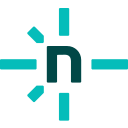

  

 

  

<h3 align="center">✨ Junior Full-Stack Developer · Backend Focused · Bangladesh | Chattogram ✨</h3>

<i>"Actively growing an engineering mindset — curious, and turning ideas into real solutions."</i>

  <a href="mailto:nishatjahanposhpa@gmail.com">📫 nishatjahanposhpa@gmail.com</a>
  &nbsp;|&nbsp;
  <a href="https://nishat-jahan-portfolio.netlify.app/">🌐 Portfolio</a>

  

 

  

 

---

##  About Me

Hi! I'm **Nishat Jahan** — a **Junior Full-Stack Developer** working with the **MERN stack** (MongoDB, Express.js, React, Node.js), Next.js, and TypeScript — with a growing focus on **backend architecture** and **databases**.

- 🟢 **Currently:** Dedicating time to Full-Stack development, building projects, and growing as a developer with an engineering mindset.
- 🎯 **My Focus:** REST APIs, server-side logic, and turning logic into real solutions
- 🌱 **Currently:** Deep-diving into backend architecture with node.js and express.js
- 🤝 Open to collaborations and freelance opportunities

---

##  Connect With Me

&nbsp;&nbsp;

&nbsp;&nbsp;

&nbsp;&nbsp;

&nbsp;&nbsp;

---

##  Tech Stack

<!DOCTYPE html>
<html lang="en">
<head>
<meta charset="UTF-8"/>
<meta name="viewport" content="width=device-width, initial-scale=1.0"/>
<title>Skills</title>

</head>
<body>

  

    
🖥️ Frontend

    

       HTML5
       CSS3
       JavaScript
       TypeScript
       React
       Next.js
       Tailwind
    

  

  

  

    
⚙️ Backend

    

       Node.js
       Express
       MongoDB
       Mongoose
    

  

  

  

    
🛠️ Tools &amp; Deployment

    

       Git
       GitHub
       VS Code
       Postman
       Firebase
       Vercel
       Netlify
    

  

</body>
</html>

---

##  GitHub Stats

  <picture>
    <source media="(prefers-color-scheme: dark)" srcset="https://github-readme-stats.vercel.app/api?username=nishatjahan62&show_icons=true&theme=tokyonight&border_radius=12&border_color=A855F7&title_color=A855F7&icon_color=A855F7&ring_color=A855F7" />
    
  </picture>
  &nbsp;&nbsp;
  <picture>
    <source media="(prefers-color-scheme: dark)" srcset="https://github-readme-stats.vercel.app/api/top-langs/?username=nishatjahan62&layout=compact&theme=tokyonight&border_radius=12&border_color=A855F7&title_color=A855F7" />
    
  </picture>

  

---

## 🚀 Featured Projects

### 🍽️ Donate-A-Bite
> A community-driven app to reduce food waste by connecting restaurants, charities, and users.

**Tech Stack:** React · Node.js · Express · MongoDB  
**Backend highlights:** RESTful API design · CRUD operations · MongoDB schema modeling  
[🔗 View Repository](https://github.com/nishatjahan62/Donate-a-bite-project)

---

### 🌙 Noor-e-Ramadan — নূরে রমজান
> A full-stack Ramadan companion app — Sehri/Iftar timings, Duas, Recipes, and personal dashboard for the Muslim community of Bangladesh.

**Tech Stack:** Next.js 15 · MongoDB Atlas · Tailwind CSS · Framer Motion · NextAuth.js  
**Backend highlights:** Authentication with NextAuth.js · MongoDB Atlas integration · API routes  
[🔗 View Repository](https://github.com/nishatjahan62/noor-e-ramadan)

---

### 📚 KnowledgeEdge
> Where curiosity meets clarity, and learning finds its edge.

**Tech Stack:** React · Node.js · Express · MongoDB  
**Backend highlights:** Express middleware · server-side routing · database integration  
[🔗 View Repository](https://github.com/nishatjahan62/Knowledge-Edge-project)

---

**✨ Thanks for visiting! Let's build something great together! 🤝**

